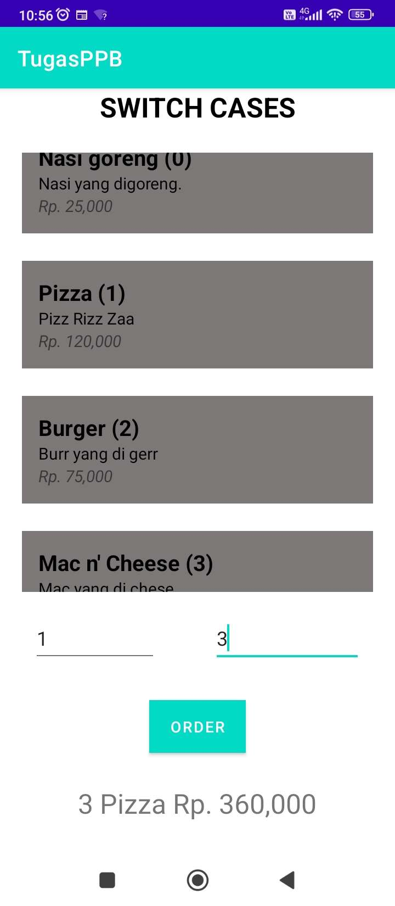
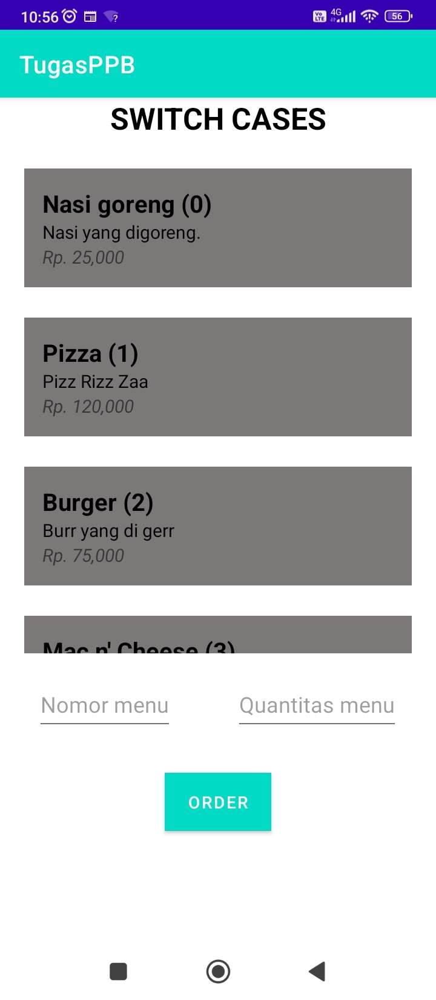

# Tugas Switch case menu
File Java yang digunakan adalah ```Swithces.java``` pada ```src > main```, beserta file ```Menu.java``` untuk class.


Untuk file XML terdapat ```activity_switches.xml``` pada ```src > main > res > layout```.


Hasil:
<p align="center">
  
  
</p>
